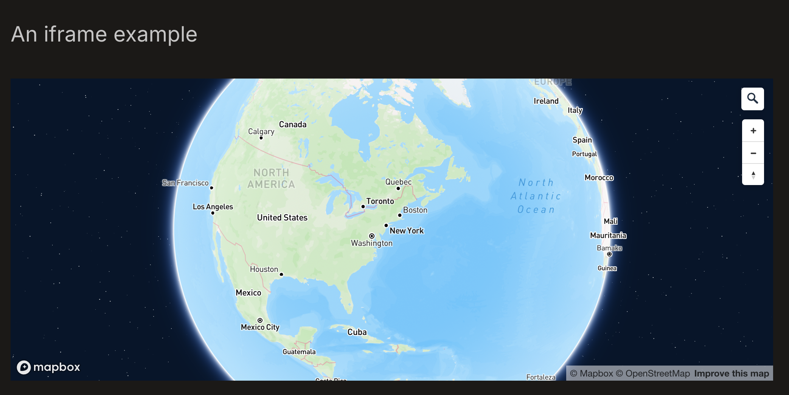

# astro-maplibre-template
Basic template for astro and maplibre, with inline, full page, and scrollytelling maps.


## 💻 Commands

All commands are run from the root of the project, from a terminal:

Replace npm with your package manager of choice. `npm`, `pnpm`, `yarn`, `bun`, etc

| Command                   | Action                                           |
| :------------------------ | :----------------------------------------------- |
| `npm install`             | Installs dependencies                            |
| `npm run dev`             | Starts local dev server at `localhost:4321`      |
| `npm run dev:network`     | Starts local dev server on local network         |
| `npm run sync`            | Generates TypeScript types for all Astro modules.|
| `npm run build`           | Build your production site to `./dist/`          |
| `npm run preview`         | Preview your build locally, before deploying     |
| `npm run preview:network` | Preview build on local network                   |
| `npm run astro ...`       | Run CLI commands like `astro add`, `astro check` |
| `npm run astro -- --help` | Get help using the Astro CLI                     |
| `npm run lint`            | Run ESLint                                       |
| `npm run lint:fix`        | Auto-fix ESLint issues                           |

## Inline
Inline maps using MDX are shown in the `inline_maps.mdx` file in `/pages`. Within the `<Container />` object you can use traditional markdown as well as the MDX `Maplibre` object. You can pass styles and layers to the map. It would be good to be able to pass the option to control layer visibility and onClick behavior from the layers arg that's passed in as well, to come.

### Inline map options

#### Inline map YAML options

##### Mixed content
To add a block of text, images, or other non-map elements, you can add a "content" type block. This block can contain any number of elements, including headers, paragraphs, images, etc. Each element is defined as a key-value pair, where the key is the element type and the value is an array of objects that define the element's content. For example, to add a header and two paragraphs, you would use the following syntax:
```
  - type: "content"
    classList: "test-div-class"
    id: "test-div-id"
    content:
      - h2: 
        - str: "A subsection"
          classList: "text-center-test"
          id: "subsection-id"
      - p: 
        - str: "You can go into more detail here."
      - p: 
        - str: "To start a new paragraph you must insert a new p section as shown here. "
```
Note that you can add a classList and id to the content block to style it as needed, and then add rules in the `styles/global.css` file to customize how the content is displayed. For example, to change the font size of the content block, you could add the following rule to the `styles/global.css` file:
```
.test-div-class {
  font-size: 1.5em;
}
```

Now, all content blocks with the class "test-div-class" will have a font size of 1.5em. You can apply the same logic to any other CSS properties you want to customize, such as color, font family, how columns or rows are handled, etc.

Further documentation on the syntax for the content block is provided below, and in the `_inline_map_components.yaml` file. 

You can also add external content via `iframe`. To do so, create a content block with the type "iframe" and pass the URL of the content you want to embed. For example, to embed a Mapbox map, you would use the following syntax:
```
  - type: "content"
    content:
      - h2: 
        - str: "An iframe example"
      - iframe:
        - src: <iframe width='100%' height='400px' src="https://api.mapbox.com/styles/v1/marioag/clzbybnep002n01p646zu2qpk.html?title=false&access_token=pk.eyJ1IjoibWFyaW9hZyIsImEiOiJjamxncWNoMDcwMDhtM3FteDZ5dDZwZHd2In0.YzWCU25slWawKWGNYbhNjQ&zoomwheel=false#2/38/-34" title="Sample Style" style="border:none;"></iframe>
```

The above code should produce the following output:


##### Map content
To add a map, you can use the "map" type block. This will allow you to create a map with specified attributes, as well as layers and layer properties (including what happens when you click on the layer). For example, to add a map with a bike lane layer, you would use the following syntax:
```
   - type: "map"
    id: "maplibremap2-test"
    classList: "test-class"
    content:
      container: "maplibremap"
      latitude: 40.8075803
      longitude: -73.9604192
      zoom: 12
      interactive: true
      mapstyle: "https://api.maptiler.com/maps/dataviz/style.json?key=WlatIY6MghFCwInJhBkl"
      containerstyle: "width: 100%; height: 70vh"
      layers:
        - id: "bikes"
        label: "Bike Lanes"
        toggle: true
        visible: true
        data-type: "geojson"
        layer-type: "line"
        url: "https://data.cityofnewyork.us/resource/mzxg-pwib.geojson?$limit=10000"
        paint: 
            line-color: "#000000"
            line-width: 3
        mouseEvent:
            - type: "click"
            content:
                - h1: 
                - str: "Feature Info"
                - p: 
                - str: "This is a bike lane."
```

##### Adding a legend

There is a div with the class `map-overlay` that can be used to display a legend for the map. The legend is defined in the `legend` object in the layer options. The `legend` object should contain an array of items, each of which is an object with a `color` and `label` property. For example, to add a legend entry for a layer with a single symbology, you would use the following syntax:
```
legend:
    items:
      - color: '#cc0000'
        label: 'Pizza Places'
```
You can add multiple items to the legend array to display multiple symbologies. You can optionally add a title to the legend by adding a `title` property to the `legend` object. For example:
```
legend:
    title: 'Legend'
    items:
      - color: '#cc0000'
        label: 'Pizza Places'
      - color: '#00cc00'
        label: 'Bike Lanes'
```

This gives you some flexibility in how you organize items in the legend.

You can update the legend div's properties based on the class and id associated with the legend div in the `styles/global.css` file. The legend has these properties and accessors, which are based on the `FullPageMap`'s container property: `<div class="map-overlay" id={`${container}-legend`}></div>` (i.e. in the basic example the id is `maplibremap-legend`). By default, the legend will appear in the top left corner; use the css rules in `styles/global.css` for `.map-overlay` and `.legend-color` to adjust the position as needed.

##### Map + Mixed content
If you feel so inclined, you can add maps and other mixed content types to the same div, which allows for better control over how content is rendered (e.g. positioning maps and other content in a row together using css). You can achieve the following using the `mixed` content block type:

```
  - type: "mixed"
    id: 'mixed-test'
    content:
    - type: "map"
      content:
        container: "maplibremapxyz"
        latitude: 40.8075803
        longitude: -73.9604192
        zoom: 12
        interactive: true
        mapstyle: "https://api.maptiler.com/maps/dataviz/style.json?key=WlatIY6MghFCwInJhBkl"
        containerstyle: "width: 100%; height: 70vh"
    - type: "content"
      content:
        - p: 
          - str: "This is a paragraph of text that is not related to the map."
```

As always, be mindful of indentation when editing the YAML file. The YAML parser is very sensitive to indentation, and will throw an error if the indentation is not correct.

## Scrollytelling
Uses a YAML convention to pass arguments to the map object. Steps are defined in `pages/scrollytelling_steps.yaml`, which is invoked in `payes/scrolltelling.mdx`. That's where the initial position and map style should be defined. Otherwise text, images, etc. should be defined in the yaml file. I'd like to continue to add features to the steps, including passing the hidden variable, animation control, and more layer control. This is just a matter of copying the mapbox scrollytelling logic over. 

#### Scrollytelling step options

| **Option**         | **Type**               | **Required** | **Description**                                                                                                    | **Example**                                                   |
|---------------------|------------------------|--------------|--------------------------------------------------------------------------------------------------------------------|---------------------------------------------------------------|
| `title`            | `string`              | Yes          | The title of the map step.                                                                                         | `"London"`                                                    |
| `center`           | `[number, number]`    | Yes          | Geographic coordinates `[longitude, latitude]` for the map center.                                                | `[-0.1278, 51.5074]`                                          |
| `zoom`             | `number`              | Yes          | Zoom level for the map.                                                                                            | `8`                                                           |
| `pitch`            | `number`              | No           | The tilt angle of the map in degrees (0-60).                                                                       | `30`                                                          |
| `bearing`          | `number`              | No           | The rotation angle of the map in degrees.                                                                          | `-10`                                                         |
| `description`      | `string`              | No           | A descriptive text for the map step.                                                                               | `"You can change the position of the overlay div..."`         |
| `media`            | `string` (URL)        | No           | URL of an image or media to display with the map step.                                                             | `"https://img.atlasobscura.com/OGZXBPY6..."`                  |
| `position`         | `"left", "right", "centered", "full"` | No           | The position of the overlay div relative to the map.                                                               | `"right"`                                                     |
| `mapAnimation`     | `"flyTo", "easeTo", "jumpTo"`   | No           | The type of animation used to transition between map steps.                                                        | `"jumpTo"`                                                    |
| `rotateAnimation`  | `boolean`             | No           | Enables map rotation when the step is active.                                                                      | `true`                                                        |
| `layers`           | `Array` of objects    | No           | A list of layers to add to the map.                                                                                | See layer object example below.                               |


## Full page
Full page maps are shown in the `full_page_map.mdx` file in `/pages`. This is a simple map that takes the same arguments as the inline map, but is rendered as a full page map. Layers are defined in the `_full_map_map_components.yaml` file in the `/components` directory.

### Full page map options

#### Adding a legend

There is a div with the class `map-overlay` that can be used to display a legend for the map. The legend is defined in the `legend` object in the layer options. The `legend` object should contain an array of items, each of which is an object with a `color` and `label` property. For example, to add a legend entry for a layer with a single symbology, you would use the following syntax:
```
legend:
    items:
      - color: '#cc0000'
        label: 'Pizza Places'
```
You can add multiple items to the legend array to display multiple symbologies. You can optionally add a title to the legend by adding a `title` property to the `legend` object. For example:
```
legend:
    title: 'Legend'
    items:
      - color: '#cc0000'
        label: 'Pizza Places'
      - color: '#00cc00'
        label: 'Bike Lanes'
```

This gives you some flexibility in how you organize items in the legend.

You can update the legend div's properties based on the class and id associated with the legend div in the `styles/global.css` file. The legend has these properties and accessors, which are based on the `FullPageMap`'s container property: `<div class="map-overlay" id={`${container}-legend`}></div>` (i.e. in the basic example the id is `maplibre-full-map-legend`). By default, the legend will appear in the top left corner; use the css rules in `styles/global.css` for `.map-overlay` and `.legend-color` to adjust the position as needed.

#### Map `Props` Interface

Baseline map options. Note that map layers are added via the `_full_map_map_components.yaml` file.

| Property         | Type          | Required | Description                                                                                                         | Example Value                    |
|------------------|---------------|----------|---------------------------------------------------------------------------------------------------------------------|----------------------------------|
| `latitude`       | `number`      | Yes      | Latitude of the map center.                                                                                         | `40.7128`                        |
| `longitude`      | `number`      | Yes      | Longitude of the map center.                                                                                        | `-74.0060`                       |
| `zoom`           | `number`      | Yes      | Initial zoom level of the map.                                                                                      | `12`                             |
| `mapstyle`       | `string`      | Yes      | URL or style object for MapLibre.                                                                                   | `"mapbox://styles/mapbox/streets-v11"` |
| `container`      | `string`      | Yes      | ID of the container where the map will be rendered.                                                                 | `"map-container"`                |
| `interactive`    | `boolean`     | No       | If `false`, the map will not respond to interaction. Defaults to `true`.                                            | `true`                           |
| `containerstyle` | `string`      | No       | CSS style to apply to the map container.                                                                            | `"height: 100%; width: 100%;"`   |
| `pitch`          | `number`      | No       | Initial pitch (tilt) of the map in degrees.                                                                         | `45`                             |
| `bearing`        | `number`      | No       | Initial bearing (rotation) of the map in degrees.                                                                   | `-30`                            |


#### Layer Options Documentation

| Property     | Type      | Required | Description                                                                                                         | Example Value                                    |
|--------------|-----------|----------|---------------------------------------------------------------------------------------------------------------------|--------------------------------------------------|
| `id`         | `string`  | Yes      | Unique identifier for the layer.                                                                                   | `'bikes'`, `'pizza'`                             |
| `label`      | `string`  | No       | Label for the layer, used for display in UI elements like toggles.                                                 | `'Bike Lanes'`, `'Pizza Places'`                 |
| `toggle`     | `boolean` | No       | Whether this layer can be toggled on or off by the user. Defaults to `true`.                                       | `true`, `false`                                  |
| `visible`    | `boolean` | No       | Initial visibility of the layer. Defaults to `false`.                                                              | `true`, `false`                                  |
| `data-type`  | `string`  | Yes      | Specifies the data type. For now, only `'geojson'` is supported.                                                   | `'geojson'`                                      |
| `layer-type` | `string`  | Yes      | Defines the type of layer, which determines how the data is rendered.                                              | `'line'`, `'circle'`, `'fill'`                             |
| `url`        | `string`  | Yes      | URL to the GeoJSON data source for this layer.                                                                     | `'https://data.cityofnewyork.us/resource/mzxg-pwib.geojson?$limit=10000'` |
| `paint`      | `object`  | No       | MapLibre paint properties for styling the layer. Values depend on the `layer-type`.                                | `{ "line-color": "#000000", "line-width": 3 }`   |
| `mouseEvent` | `array`   | No       | Array of events to listen for on this layer, specifying popup content on event.                                    | See detailed `mouseEvent` table below            |
| `legend`     | `object`  | No       | Legend properties for the layer.                                                                                   | ```legend: {items: [{color:'#fff', label:'white orb'}]} ``` |

#### `mouseEvent` Content

| Property   | Type         | Required | Description                                                                                                       | Example Value                           |
|------------|--------------|----------|-------------------------------------------------------------------------------------------------------------------|-----------------------------------------|
| `type`     | `string`     | Yes      | Type of mouse event to listen for. Options include `"click"`, `"mousemove"`, `"mouseenter"`, `"mouseleave"`.      | `"click"`                               |
| `content`  | `array`      | Yes      | Array of elements to display in the popup. Each item is an object containing a tag (`h1`, `p`, etc.) and content. You can pass multiple tags together to position feature attributes between text, etc. | `[ { "h1": [{ "str": "Feature Info" }] } ]` |


#### `content` Format

Each item in the `content` array in `mouseEvent` consists of a tag and a list of items for that tag. Items can be static strings or dynamic properties.

| Property   | Type          | Required | Description                                      | Example Value                      |
|------------|---------------|----------|--------------------------------------------------|------------------------------------|
| `str`      | `string`      | No       | Static text to display.                          | `"Feature Info"`                   |
| `property` | `string`      | No       | Property key to retrieve from feature properties.| `"dba"`. Must match an attribute name in `features[0].properties`                            |
| `else`     | `string`      | No       | Fallback text if the property value is unavailable. | `"N/A"`                        |
| `href`     | `string`      | No       | Link URL (used only with `<a>` tags).            | `"https://example.com"`            |
| `text`     | `string`      | No       | Text for the link (used only with `<a>` tags).   | `"More info"`                      |
| `src`      | `string`      | No       | Source URL for an image (used only with `` tags). | `"https://example.com/image.png"` |
| `alt`      | `string`      | No       | Alt text for the image (used only with `` tags). | `"Alternative text"`            |

